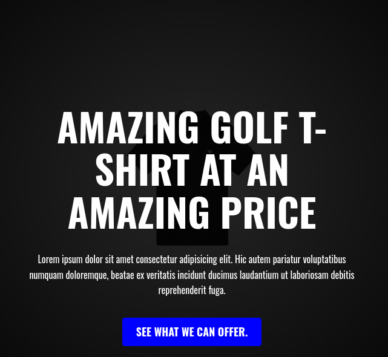

### Golf T-shirt

## Table of contents

- [Overview](#overview)
  - [The challenge](#the-challenge)
  - [Screenshot](#screenshot)
  - [Links](#links)
- [My process](#my-process)
  - [Built with](#built-with)
  - [Continued development](#continued-development)
- [Author](#author)

## Overview

### The challenge

Users should be able to:

- The website landing page the user can able to view the website using any devices moble, table and desk-top
- User can able to play around the website and see some functions happening can hover on the button and also on the items.

### Links

- Solution URL: [link](https://github.com/Ziphozenkosimthombe/CODSOFT.git)

## My process

### Built with

- HTML5
- CSS
- Flexbox

### Continued development

I want to continue developing this web application. After i am done with learning ReactJs i want to put more feature on this website i want it to be the full stack web application to have the client side using html, css javascript and also the javascript framework which is ReactJs and also on the server side i will be able to use NodeJs, ExpressJs and MongoDB

## Author

- Website - [zipho.netlify.app](https://zipho.netlify.app)
- Twitter - [@ziphozenkosi478](https://www.twitter.com/ziphozenkosi478)
